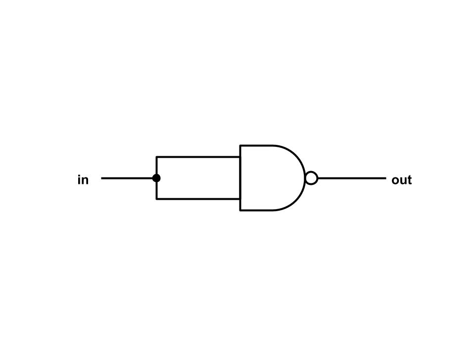
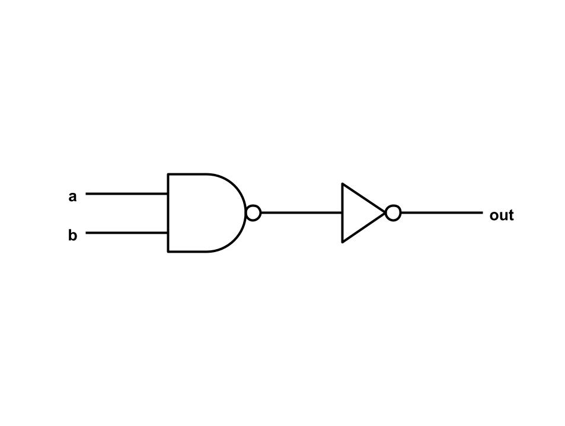
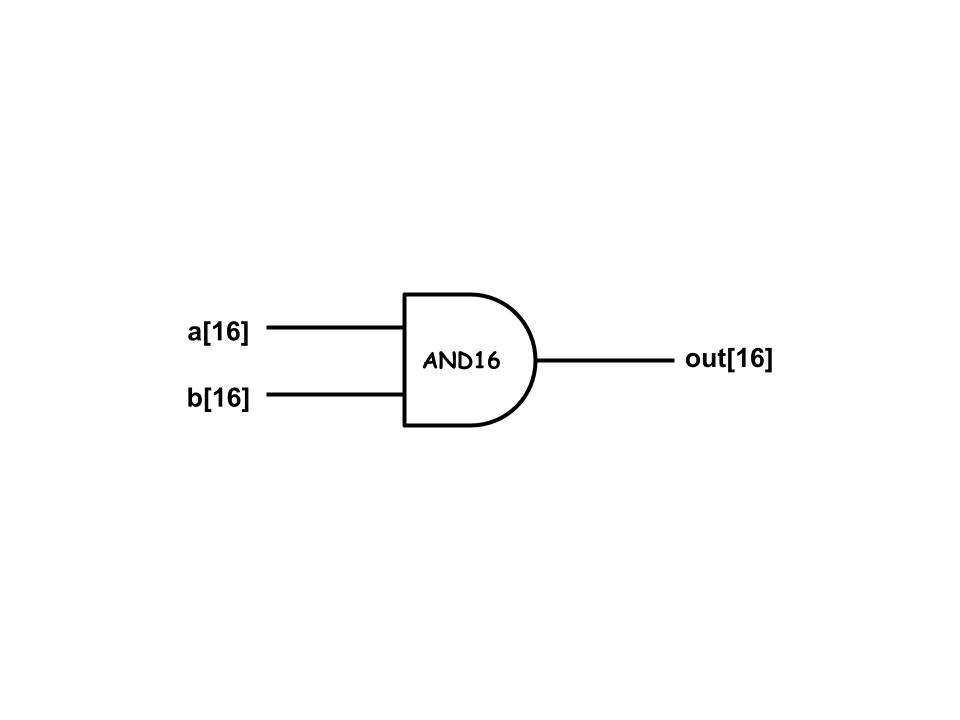
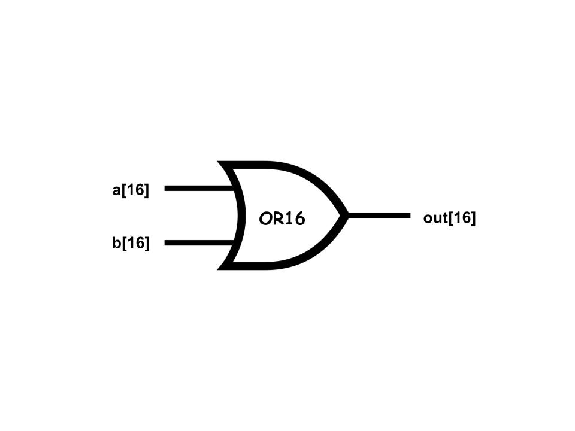
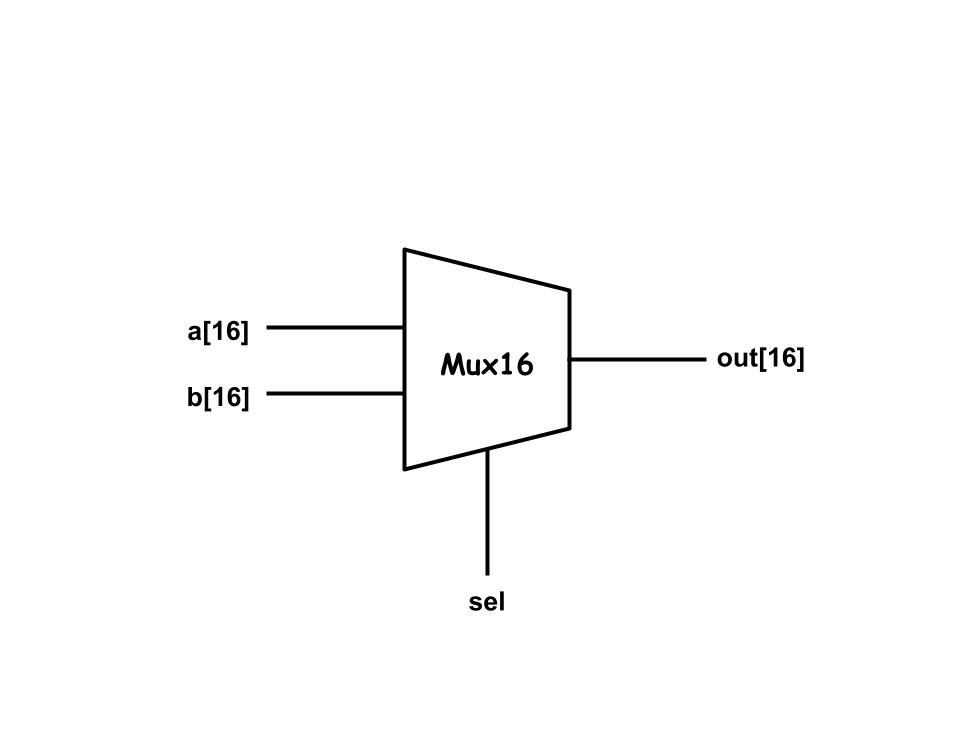

# 第一章習題
資工一 111210520 吳佳泰

---

## 作業內容
* **第一週(09/12)作業 :** NOT、AND、OR、XOR、Mux、DMux
* **第二週(09/19)作業 :** NOT16、AND16、OR16、Mux16、OR8Way、Mux4Way16、Mux8Way16、DMux4Way、DMux8Way

## 關於作業
* 作業獨立完成，不會的部分參考網路資料(電路圖)
* 電路圖整理在本檔案(README.md)和每個例題下方的超連結，使用Google繪圖繪製(內部繪製之OR閘的圖片來源為[維基百科](https://zh.wikipedia.org/zh-tw/%E6%88%96%E9%97%A8#/media/File:OR_ANSI.svg))

## 參考資料
* [From Nand to Tetris](https://www.nand2tetris.org/)
* [CircuitVerse](https://circuitverse.org/)

## 作業詳情
* ### [NOT](Not.hdl)
  
  
* ### [AND](AND.hdl)  
  

* ### [OR](OR.hdl)  
  

* ### [XOR](XOR.hdl)  
  

* ### [Mux](Mux.hdl)  
  

* ### [DMux](DMux.hdl)
  

* ### [NOT16](NOT16.hdl)  
  

* ### [AND16](AND16.hdl)
  
  
* ### [OR16](OR16.hdl)  
  

* ### [Mux16](Mux16.hdl)  
  

* ### [OR8Way](OR8Way.hdl)  
  

* ### [Mux4Way16](Mux4Way16.hdl)
  

* ### [Mux8Way16](Mux8Way16.hdl)
  

* ### [DMux4Way](DMux4Way.hdl)
  

* ### [DMux8Way](DMux8Way.hdl)
  