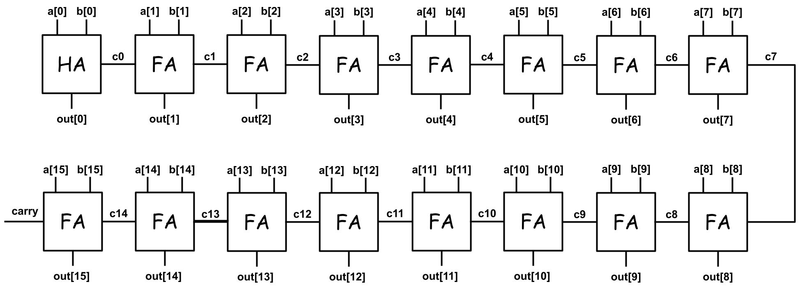
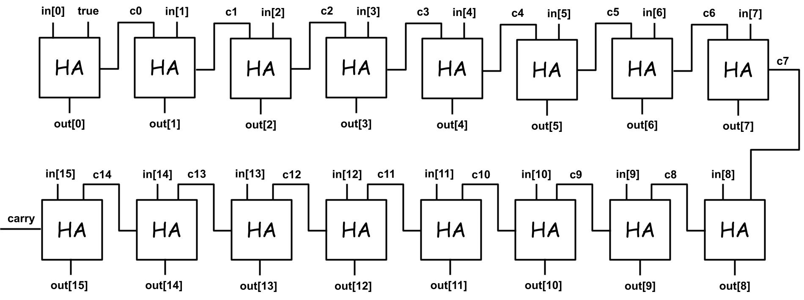
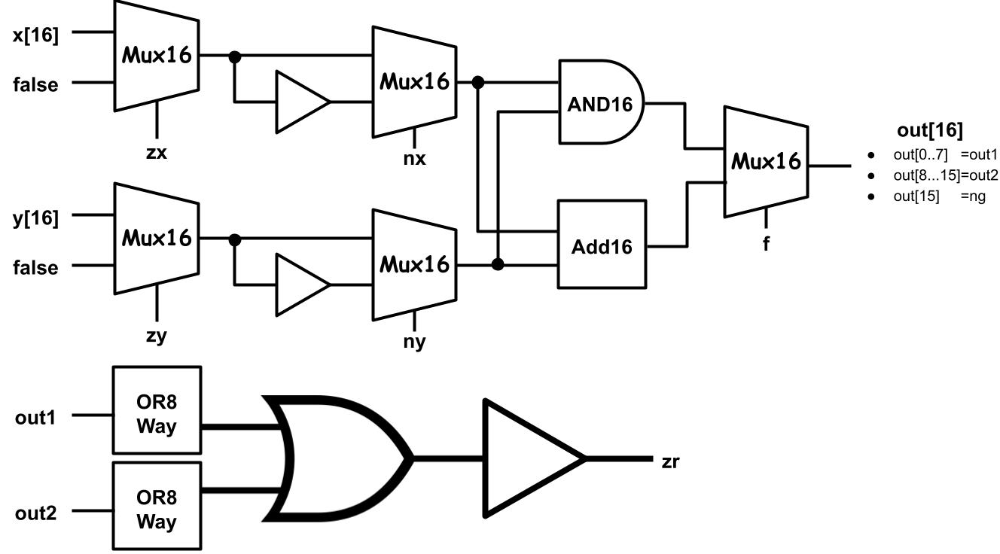

# 第二章習題
資工二 111210520 吳佳泰

---

## 作業內容
* **第三週(09/27)作業 :** HalfAdder、FullAdder、Add16、Inc16
* **第六週(10/18)作業 :** ALU
> 註:中途經過第四週(10/03)颱風假、第五週(10/10)國慶日放假

## 關於作業
* 作業獨立完成
* 電路圖整理在本檔案(README.md)和每個例題下方的超連結
* 電路圖使用[Google繪圖](https://docs.google.com/drawings/d/16axyYoLa7msynRIwtvtNS606HYFQQHoPoyoQr2v-9Pc/edit?hl=zh-tw)繪製(內部繪製之OR閘和XOR閘的圖片來源為[維基百科-OR_ANSI](https://zh.wikipedia.org/zh-tw/%E6%88%96%E9%97%A8#/media/File:OR_ANSI.svg)以及[維基百科-XOR_ANSI](https://commons.wikimedia.org/wiki/File:XOR_ANSI.svg))

## 參考資料
* [From Nand to Tetris](https://www.nand2tetris.org/)
* [CircuitVerse](https://circuitverse.org/)
* [老師的教材內容](https://github.com/ccc113a/_co/blob/master/02/%E8%9E%A2%E5%B9%95%E5%BF%AB%E7%85%A7%202021-10-07%20%E4%B8%8A%E5%8D%889.51.16.png)

## 作業詳情
* ### [HalfAdder](HalfAdder.hdl)
    |   a   |   b   |  sum  | carry |
    |:---: |:---: |:---: |:---:
    |   0   |   0   |   0   |   0   |
    |   0   |   1   |   1   |   0   |
    |   1   |   0   |   1   |   0   |
    |   1   |   1   |   0   |   1   | 

    

* ### [FullAdder](FullAdder.hdl)
    |   a   |   b   |   c   |  sum  | carry |
    |:---: |:---: |:---: |:---: |:---: 
    |   0   |   0   |   0   |   0   |   0   |
    |   0   |   0   |   1   |   1   |   0   |
    |   0   |   1   |   0   |   1   |   0   |
    |   0   |   1   |   1   |   0   |   1   |
    |   1   |   0   |   0   |   1   |   0   |
    |   1   |   0   |   1   |   0   |   1   |
    |   1   |   1   |   0   |   0   |   1   |
    |   1   |   1   |   1   |   1   |   1   |
 
    

* ### [Add16](Add16.hdl)
    

* ### [Inc16](Inc16.hdl)
    

* ### [ALU](ALU.hdl)
    