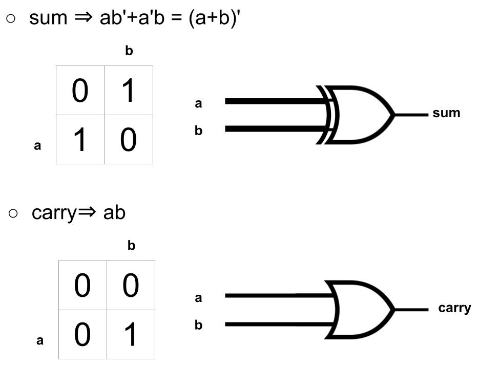
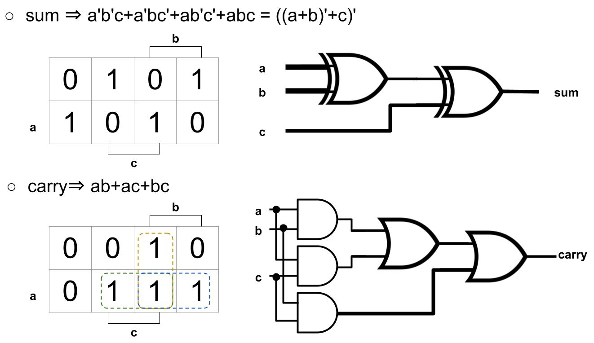

# 第二章習題
資工一 111210520 吳佳泰

---

## 作業內容
* **第三週(09/12)作業 :** HalfAdder、FullAdder、Add16、Inc16
* **第四週(09/19)作業 :** 

## 關於作業

## 參考資料
* [From Nand to Tetris](https://www.nand2tetris.org/)
* [CircuitVerse](https://circuitverse.org/)

## 作業詳情
* ### [HalfAdder](HalfAdder.hdl)
    |   a   |   b   |  sum  | carry |
    |:---: |:---: |:---: |:---:
    |   0   |   0   |   0   |   0   |
    |   0   |   1   |   1   |   0   |
    |   1   |   0   |   1   |   0   |
    |   1   |   1   |   0   |   1   | 

    

* ### [FullAdder](FullAdder.hdl)
    |   a   |   b   |   c   |  sum  | carry |
    |:---: |:---: |:---: |:---: |:---: 
    |   0   |   0   |   0   |   0   |   0   |
    |   0   |   0   |   1   |   1   |   0   |
    |   0   |   1   |   0   |   1   |   0   |
    |   0   |   1   |   1   |   0   |   1   |
    |   1   |   0   |   0   |   1   |   0   |
    |   1   |   0   |   1   |   0   |   1   |
    |   1   |   1   |   0   |   0   |   1   |
    |   1   |   1   |   1   |   1   |   1   |
 
    

* ### [Add16](Add16.hdl)
