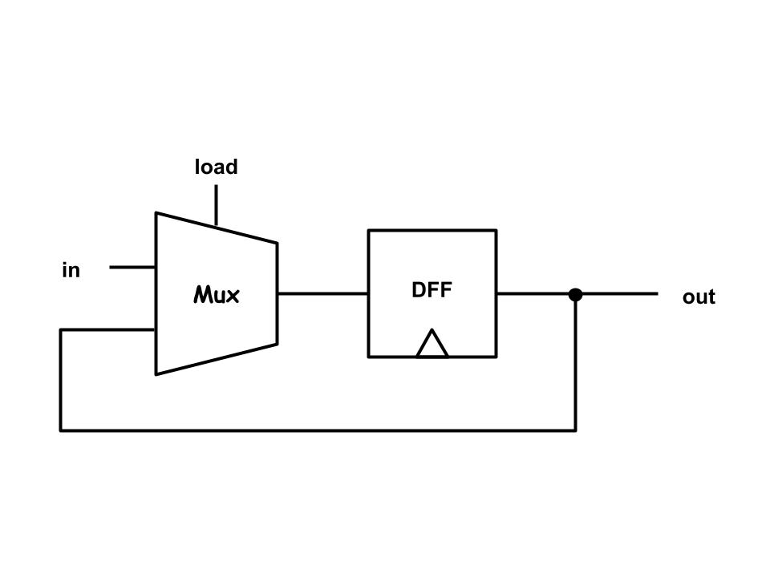

# 第三章習題
資工二 111210520 吳佳泰

---

## 作業內容
* **第七週(10/24)作業 :** Bit、Register、RAM8、RAM64
* **第九週(11/06)作業 :** 
> 註:中途經過第八週(10/31)颱風假

## 關於作業
* 作業獨立完成
* 電路圖整理在本檔案(README.md)和每個例題下方的超連結
* 電路圖使用[Google繪圖](https://docs.google.com/drawings/d/16axyYoLa7msynRIwtvtNS606HYFQQHoPoyoQr2v-9Pc/edit?hl=zh-tw)繪製(內部繪製之OR閘和XOR閘的圖片來源為[維基百科-OR_ANSI](https://zh.wikipedia.org/zh-tw/%E6%88%96%E9%97%A8#/media/File:OR_ANSI.svg)以及[維基百科-XOR_ANSI](https://commons.wikimedia.org/wiki/File:XOR_ANSI.svg))

## 參考資料
* [From Nand to Tetris](https://www.nand2tetris.org/)
* [Duck University](https://people.duke.edu/~nts9/)

## 作業詳情
* ### [Bit](a/Bit.hdl)
    

* ### [Register](a/Register.hdl)
    

* ### [RAM8](a/RAM8.hdl)
    

* ### [RAM64](a/RAM64.hdl)
    
