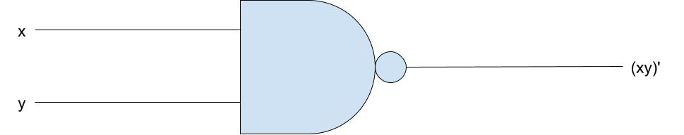
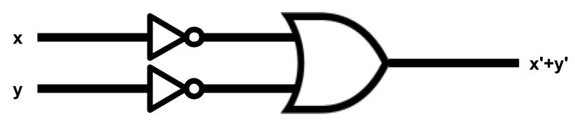

# Question:證明迪摩根定律第二式 (xy)'=x'+y'

# Answer:
## 真值表

x | y | | x' | y' | | (xy)' | x'+y'
|:---: |:---: |:---: |:---: |:---: |:---: |:---: |:---:
0 | 0 | | 1 | 1 | | 1 | 1 
0 | 1 | | 1 | 0 | | 1 | 1
1 | 0 | | 0 | 1 | | 1 | 1
1 | 1 | | 0 | 0 | | 0 | 0
>由上列真值表可知 **(xy)'=x'+y'**

## 電路圖
* (xy)'
* x'+y'

---
**備註 :** 本作業採用markdown檔案完成，圖片由google繪圖繪製(OR閘圖片來源為[維基百科](https://zh.wikipedia.org/zh-tw/%E6%88%96%E9%97%A8))
